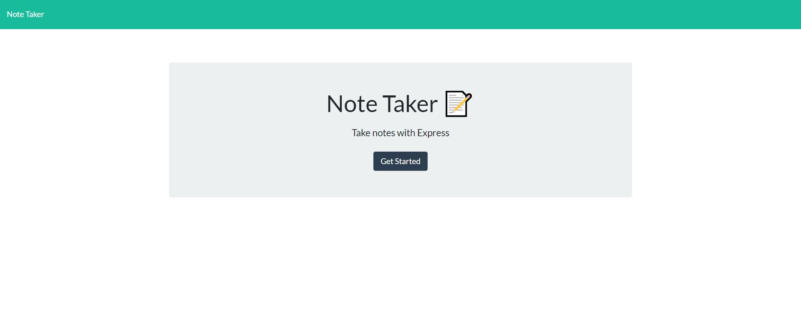

# Note Taker

## Project Description
This is a server based note taking application allowing the user to save, retrieve, and delete notes.

## Installation

Clone the repository and install the npm dependencies.

## Usage

This application can be used to save notes.

## Deployed Application

https://tranquil-depths-88353.herokuapp.com/
